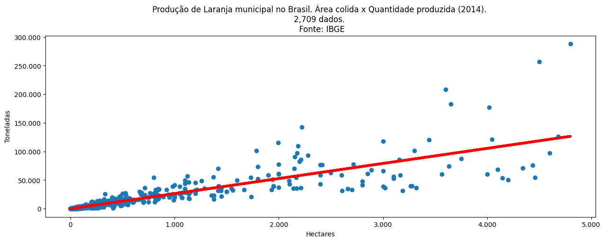

# 📊 Regressão Linear: Produção de Laranjas municipais no Brasil em 2014

Este repositório contém dois notebooks que realizam uma análise de regressão linear sobre a **produção de laranjas em toneladas por área colhida (hectares)** em 2014, utilizando dados obtidos diretamente de um bucket do **Google Cloud Console**.

## 📁 Estrutura do Projeto

- `main.ipynb` – Notebook com implementação profissional da regressão linear usando bibliotecas como:
  - `pandas`
  - `numpy` (`polyfit`)
  - `matplotlib`

- `raw_main.ipynb` – Notebook com abordagem educacional/manual:
  - Sem uso de `numpy`
  - Apenas `pandas` e lógica de regressão linear codificada "na unha"


## 🧠 Objetivo

Demonstrar:
- Como extrair e manipular dados de uma fonte externa (Google Cloud Bucket)
- Como aplicar regressão linear para entender a relação entre área colhida e quantidade produzida
- Diferenças entre uma abordagem matemática manual e outra com uso de bibliotecas científicas

## 📷 Exemplo de Gráfico




## ▶️ Como Executar

1. Clone este repositório:

```bash
git clone https://github.com/seu-usuario/seu-repositorio.git
cd seu-repositorio
```

2. Crie e ative um ambiente virtual (opcional, mas recomendado):

```bash
python -m venv venv
source venv/bin/activate  # ou venv\Scripts\activate no Windows
```

3. Instale as dependências:

```bash
pip install -r requirements.txt
```

4. Execute os notebooks em um ambiente Jupyter:

```bash
jupyter notebook
```

## 📦 Requisitos (requirements.txt)

```txt
pandas
numpy
matplotlib
```

> Obs: A conexão com o bucket do Google Cloud exigie permissões e autenticação.

## 👨‍💻 Autor

- **Victor Antunes**
- GitHub: [@wdvictor](https://github.com/wdvictor)

---

Sinta-se à vontade para contribuir, comentar ou sugerir melhorias!
